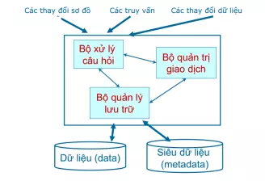

# Buổi 1: Nhập môn CSDL

## 1. CSDL

## 1.1 Cơ sở dữ liệu là gì?

- Cơ sở dữ liệu (database) là một tập hợp các dữ liệu rời rạc được tổ chức, lưu trữ và quản lý theo hệ thống để có thể dễ dàng truy xuất, chỉnh sửa và cập nhật. Chúng thường được sử dụng để lưu trữ thông tin trong các hệ thống phần mềm và ứng dụng, từ dữ liệu các nhận cho đến thông tin doanh nghiệp quan trọng. CSDL giúp các tổ chức và cá nhân tổ chức dữ liệu một cách có cấu trúc, nhằm mục đích quản lý và xử lý dữ liệu hiệu quả hơn.
- Ví dụ: thư viện là một csdl, phân loại sách theo chủ đề cũng là 1 csdl đơn giản
- **Mục đích sử dụng csdl** là vì cho dễ quản lý và tìm kiếm, thống nhật việc lưu trữ thông tin. Có thể tìm kiếm một cách nhanh chóng khi cần thông tin nào đó và cũng có thể lấy các thông tin liên quan với thông tin đó.

## 1.2 Đặc điểm của cơ sở dữ liệu

- Cơ sở dữ liệu (CSDL) có nhiều đặc điểm quan trọng giúp quản lý, tổ chức và xử lý dữ liệu một cách hiệu quả. Những đặc điểm này đảm bảo rằng dữ liệu được lưu trữ, truy xuất và bảo mật một cách tối ưu, đồng thời hỗ trợ các ứng dụng và hệ thống trong việc quản lý thông tin. Dưới đây là các đặc điểm chính của cơ sở dữ liệu:
  - **Tính tổ chức và cấu trúc**: CSDL tổ chức dữ liệu theo một cấu trúc có hệ thống, thường được thiết kế dưới dạng bảng, đối tượng hoặc mô hình dữ liệu khác. Cấu trúc này giúp dữ liệu được tổ chức một cách hợp lý, dễ dàng truy cập và quản lý.
  - **Khả năng truy xuất và tìm kiếm**: CSDL cho phép người dùng truy xuất và tìm kiếm dữ liệu nhanh chóng và hiệu quả thông qua các truy vấn. Các hệ quản trị cơ sở dữ liệu (DBMS) cung cấp ngôn ngữ truy vấn, chẳng hạn như SQL, để thực hiện các thao tác này.
  - **Tính nhất quán và toàn vẹn**: CSDL đảm bảo rằng dữ liệu luôn được duy trì một cách chính xác và nhất quán thông qua các ràng buộc toàn vẹn. Các quy tắc này bao gồm khóa chính, khóa ngoại và các hạn chế khác để bảo vệ dữ liệu khỏi lỗi và mất mát.
  - **Khả năng mở rộng**: CSDL có thể mở rộng để xử lý khối lượng dữ liệu ngày càng tăng và đáp ứng nhu cầu của ứng dụng. Điều này có thể được thực hiện thông qua việc thêm phần cứng hoặc sử dụng các kỹ thuật phân tán và phân mảnh dữ liệu.
  - **Bảo mật và quyền truy cập**: CSDL cung cấp các cơ chế bảo mật để bảo vệ dữ liệu khỏi các truy cập trái phép. Điều này bao gồm việc thiết lập quyền truy cập, mã hóa dữ liệu và theo dõi các hoạt động của người dùng.
  - **Khả năng sao lưu và phục hồi**: CSDL hỗ trợ sao lưu dữ liệu định kỳ và phục hồi dữ liệu khi xảy ra sự cố. Các chức năng này giúp đảm bảo rằng dữ liệu có thể được khôi phục về trạng thái trước đó trong trường hợp mất mát hoặc hỏng hóc.
  - **Quản lý giao dịch**: CSDL hỗ trợ quản lý giao dịch, đảm bảo rằng các thao tác trên dữ liệu được thực hiện một cách nguyên tử, nhất quán, tách biệt và bền vững. Điều này giúp duy trì tính toàn vẹn của dữ liệu ngay cả khi xảy ra lỗi hệ thống.
  - **Khả năng hỗ trợ đồng thời**: CSDL có khả năng xử lý nhiều yêu cầu và giao dịch đồng thời từ nhiều người dùng mà không làm giảm hiệu suất hoặc làm mất dữ liệu. Điều này được thực hiện thông qua các cơ chế khóa và quản lý đồng thời.
  - **Tính tương thích**: CSDL có thể tương thích với các ứng dụng và hệ thống khác thông qua các giao thức và giao diện chuẩn. Điều này cho phép tích hợp dữ liệu từ nhiều nguồn khác nhau và hỗ trợ các quy trình doanh nghiệp.

## 1.3 Phân loại Database

### 1.3.1 Phân loại theo dữ liệu:

- **Cơ sở dữ liệu có cấu trúc** (Structured Database): Dữ liệu được tổ chức theo cấu trúc cố định, thường là các bảng với hàng và cột. Ví dụ: Cơ sở dữ liệu quan hệ (RDBMS) như MySQL, PostgreSQL.

- **Cơ sở dữ liệu phi cấu trúc** (Unstructured Database): Dữ liệu không có cấu trúc cố định, chẳng hạn như văn bản tự do, email, hình ảnh. Ví dụ: Dữ liệu trong các hệ thống lưu trữ đám mây.
- **Cơ sở dữ liệu bán cấu trúc** (Semi-Structured Database): Dữ liệu có cấu trúc nhưng không hoàn toàn theo quy tắc cố định. Ví dụ: Dữ liệu JSON, XML

### 1.3.2 Phân loại theo mô hình tổ chức và lưu trữ

- **Cơ sở dữ liệu quan hệ** (Relational Database): Dữ liệu được lưu trữ trong các bảng và có thể được liên kết với nhau thông qua các khóa. Ví dụ: MySQL, Oracle, SQL Server.
- **Cơ sở dữ liệu phân cấp** (Hierarchical Database): Dữ liệu được tổ chức theo cấu trúc cây với các mối quan hệ cha-con. Ví dụ: IBM Information Management System (IMS).
- **Cơ sở dữ liệu mạng** (Network Database): Dữ liệu được tổ chức theo mạng lưới với các mối quan hệ linh hoạt hơn giữa các bản ghi. Ví dụ: Integrated Data Store (IDS).
- **Cơ sở dữ liệu hướng đối tượng** (Object-Oriented Database): Dữ liệu được lưu trữ dưới dạng các đối tượng, tương tự như lập trình hướng đối tượng. Ví dụ: ObjectDB, db4o.
- **Cơ sở dữ liệu NoSQL** (Not Only SQL): Dữ liệu được lưu trữ theo nhiều mô hình khác nhau không phải là bảng. Ví dụ: MongoDB (dữ liệu tài liệu), Cassandra (dữ liệu cột), Redis (dữ liệu key-value).

### 1.3.3. Phân loại theo mô hình triển khai

- **Cơ sở dữ liệu tập trung** (Centralized Database): Được lưu trữ và quản lý tại một địa điểm duy nhất. Ví dụ: Cơ sở dữ liệu trong các hệ thống máy chủ trung tâm.
- **Cơ sở dữ liệu phân tán** (Distributed Database): Dữ liệu được lưu trữ và xử lý tại nhiều địa điểm khác nhau, kết nối qua mạng. Ví dụ: Google Cloud Spanner, Apache Cassandra.
- **Cơ sở dữ liệu tập trung có bản sao** (Centralized with Replica Database): Kết hợp giữa cơ sở dữ liệu tập trung và phân tán, với một cơ sở dữ liệu chính và các bản sao ở các địa điểm khác. Ví dụ: Hệ thống sao lưu dữ liệu trong các dịch vụ đám mây.

## 2. Hệ quản trị CSDL là gì?

- Hệ quản trị cơ sở dữ liệu (DBMS) là một phần mềm cho phép tạo lập các CSDL cho các ứng dụng khác nhau và điều khiển mọi truy cập tới các CSDL đó. Nghĩa là, hệ quản trị CSDL cho phép định nghĩa (xác định kiểu, cấu trúc, ràng buộc dữ liệu), tạo lập (lưu trữ dữ liệu trên các thiết bị nhớ) và thao tác (truy vấn, cập nhật, kết xuất, ...) các CSDL cho các ứng dụng khác nhau. Ví dụ: MS. Access, MS. SQL Server, ORACLE, IBM DB2, ...



- Bộ Quản lý lưu trữ

  - Lưu trữ và truy xuất dữ liệu trên các thiết bị nhớ.
  - Tổ chức tối ưu dữ liệu trên thiết bị nhớ.
  - Tương tác hiệu quả với bộ quản lý tệp.

- Bộ xử lý câu hỏi

  - Tìm kiếm dữ liệu trả lời cho một yêu cầu truy vấn.
  - Biến đổi truy vấn ở mức cao thành các yêu cầu có thể hiểu được bởi hệ CSDL.
  - Lựa chọn một kế hoạch tốt nhất để trả lời truy vấn này.

- Bộ Quản trị giao dịch

  - Định nghĩa giao dịch: một tập các thao tác được xử lý như một đơn vị không chia căt được.
  - Đảm bảo tính đúng đắn và tính nhất quán của dữ liệu.
  - Quản lý điều khiển tương tranh.
  - Phát hiện lỗi và phục hồi CSDL

- Một số hệ quản trị CSDL: MySQL, SQL,...

## 3. Câu lệnh tạo database, table trong MS SQL Server

- Tạo DB:

```sql
CREATE DATABASE MyDatabase;
```

-> Sau đó chọn db để làm việc:

```sql
USE MyDatabase;
```

- Tạo table:
  -> Ví dụ tạo bảng `Users` với các cột `Id, Username, Password, Email`:

```sql
CREATE TABLE Users(
  Id INT PRIMARY KEY IDENTITY(1,1), -- cột Id tự tăng, khóa chính
  Username NVARCHAR(50) NOT NULL, --chuỗi Unicode, max 50 char
  Password NVARCHAR(255) NOT NULL, -- mật khẩu
  Email NVARCHAR(100) UNIQUE
);
```

- Thêm bảng khác:

```sql
CREATE TABLE Tasks(
  TaskId INT PRIMARY KEY IDENTITY(1,1),
  Description NVARCHAR(255) NOT NULL,
  DueDate DATETIME,
  Priotity INT CHECK(Priority BETWEEN 1 AND 5),
  Status BIT DEFAULT 0,
  UserID INT,
  FOREIGN KEY (UserId) REFERENCES Users(Id) --liên kết với bảng User
);
```

- Kiểm tra danh sách db và bảng:

  - Xem db hiện có

  ```sql
  SELECT name FROM sys.databases;
  ```

  - Xem bảng trong db hiện tại:

  ```sql
  SELECT * FROM sys.tables;
  ```
