- [Buổi 2 - Cơ bản về thiết kế cơ sở dữ liệu](#buổi-2---cơ-bản-về-thiết-kế-cơ-sở-dữ-liệu)
  - [1. Lý thuyết về thiết kế cơ sở dữ liệu](#1-lý-thuyết-về-thiết-kế-cơ-sở-dữ-liệu)
    - [1.1. Thiết kế cơ sở dữ liệu là gì?](#11-thiết-kế-cơ-sở-dữ-liệu-là-gì)
    - [1.2. Tầm quan trọng của việc thiết kế cơ sở dữ liệu hiệu quả](#12-tầm-quan-trọng-của-việc-thiết-kế-cơ-sở-dữ-liệu-hiệu-quả)
    - [1.3. Như thế nào là một thiết kế cơ sở dữ liệu tốt?](#13-như-thế-nào-là-một-thiết-kế-cơ-sở-dữ-liệu-tốt)
    - [1.4. Quy trình thiết kế cơ sở dữ liệu](#14-quy-trình-thiết-kế-cơ-sở-dữ-liệu)
      - [1.4.1. Xác định mục đích CSDL](#141-xác-định-mục-đích-csdl)
      - [1.4.2. Tổ chức thông tin](#142-tổ-chức-thông-tin)
      - [1.4.3. Thiết kế CSDL phần logic](#143-thiết-kế-csdl-phần-logic)
      - [1.4.4. Áp dụng các quy tắc chuẩn hóa:](#144-áp-dụng-các-quy-tắc-chuẩn-hóa)
      - [1.4.5. Thiết kế cơ sở dữ liệu phần vật lý](#145-thiết-kế-cơ-sở-dữ-liệu-phần-vật-lý)
    - [1.5. 11 nguyên tắc thiết kế csdl](#15-11-nguyên-tắc-thiết-kế-csdl)
  - [2. Lược đồ quan hệ ERD:](#2-lược-đồ-quan-hệ-erd)
    - [2.1. Vai trò của mô hình ERD trong quá trình thiết kế cơ sở dữ liệu:](#21-vai-trò-của-mô-hình-erd-trong-quá-trình-thiết-kế-cơ-sở-dữ-liệu)
    - [2.2. Các thành phần cơ bản của ERD](#22-các-thành-phần-cơ-bản-của-erd)
      - [2.2.1. Thực thể và tập thực thể](#221-thực-thể-và-tập-thực-thể)
      - [2.2.2. Thuộc tính:](#222-thuộc-tính)
      - [2.2.3. ERD:](#223-erd)
      - [2.2.4. Các kiểu liên kết trong ERD:](#224-các-kiểu-liên-kết-trong-erd)
  - [3. Mô hình dữ liệu quan hệ](#3-mô-hình-dữ-liệu-quan-hệ)
    - [3.1. Mô hình dữ liệu quan hệ là gì?](#31-mô-hình-dữ-liệu-quan-hệ-là-gì)
    - [3.2. Quy tắc chuyển đổi ERD sang mô hình DL quan hệ](#32-quy-tắc-chuyển-đổi-erd-sang-mô-hình-dl-quan-hệ)
  - [4. Chuẩn hóa dữ liệu: 1NF, 2NF, 3NF.](#4-chuẩn-hóa-dữ-liệu-1nf-2nf-3nf)
    - [4.1. Chuẩn hóa dữ liệu là gì?](#41-chuẩn-hóa-dữ-liệu-là-gì)
    - [4.2. Tại sao cần chuẩn hóa dữ liệu?](#42-tại-sao-cần-chuẩn-hóa-dữ-liệu)
    - [4.3. Dạng chuẩn hóa đầu tiên 1NF:](#43-dạng-chuẩn-hóa-đầu-tiên-1nf)
    - [4.4. Dạng Chuẩn Hóa Thứ Hai (2NF)](#44-dạng-chuẩn-hóa-thứ-hai-2nf)
    - [4.5. Dạng Chuẩn Hóa Thứ Ba (3NF)](#45-dạng-chuẩn-hóa-thứ-ba-3nf)

# Buổi 2 - Cơ bản về thiết kế cơ sở dữ liệu

---

## 1. Lý thuyết về thiết kế cơ sở dữ liệu

### 1.1. Thiết kế cơ sở dữ liệu là gì?

- Thiết kế cơ sở dữ liệu là quá trình xây dựng cấu trúc cho một CSDL nhằm xác định cách thức lưu trữ, tổ chức và truy cập dữ liệu. Quá trình này bao gồm:
  - Xác định các yêu cầu của hệ thống
  - Định nghĩa lược đồ CSDL
  - Phân tích các thực thể và mối quan hệ giữa chúng
  - Xác định các kiểu dữ liệu và phương thức lưu trữ tối ưu nhất.

---

### 1.2. Tầm quan trọng của việc thiết kế cơ sở dữ liệu hiệu quả

- Thiết kế cơ sở dữ liệu giữ vai trò quan trọng đối với nhiều hoạt động của doanh nghiệp vì nó đảm bảo rằng dữ liệu được quản lý một cách hiệu quả, chính xác và an toàn. Các doanh nghiệp phụ thuộc rất nhiều vào dữ liệu để vận hành và đưa ra các quyết định, do đó thiết kế cơ sở dữ liệu tốt là yếu tố then chốt để đạt được điều này.

- Dưới đây là một số lợi ích mà một CSDL hiệu quả đem lại: + **Tối ưu hóa hiệu suất**: Thiết kế cơ sở dữ liệu hiệu quả sẽ giúp cải thiện khả năng truy cập, tăng tốc độ xử lý và rút ngắn thời gian phản hồi đến máy chủ, giúp giảm thiểu tình trạng tắc nghẽn hệ thống do xử lý chậm, đảm bảo hoạt động kinh doanh diễn ra suôn sẻ.
  - **Đảm bảo tính toàn vẹn dữ liệu**: Thiết kế cơ sở dữ liệu chuẩn sẽ giúp đảm bảo sự nhất quán của dữ liệu, tránh tình trạng lưu trữ những dữ liệu bị dư thừa. Điều này giúp đảm bảo tuân thủ các ràng buộc dữ liệu, duy trì tính chính xác và đáng tin cậy của thông tin.
  - **Dễ dàng bảo trì và mở rộng**: Một cơ sở dữ liệu được thiết kế tốt sẽ dễ dàng bảo trì, giúp tiết kiệm thời gian và công sức cho việc cập nhật và sửa chữa. Thiết kế linh hoạt cũng cho phép mở rộng cơ sở dữ liệu một cách dễ dàng khi nhu cầu của doanh nghiệp tăng lên.
  - **Tiết kiệm tài nguyên**: Thiết kế hiệu quả giúp sử dụng tài nguyên hệ thống một cách tối ưu, giảm chi phí phần cứng và phần mềm. Việc loại bỏ dữ liệu trùng lặp và không cần thiết cũng giảm yêu cầu về bộ nhớ và không gian lưu trữ.
  - **Nâng cao bảo mật**: Một cơ sở dữ liệu được thiết kế tốt sẽ có các cơ chế bảo mật mạnh mẽ, bảo vệ dữ liệu khỏi các mối đe dọa và truy cập trái phép. Áp dụng các quyền truy cập và kiểm soát dữ liệu giúp đảm bảo rằng chỉ những người có thẩm quyền mới có thể truy cập và chỉnh sửa dữ liệu.
  - **Hỗ trợ việc đưa ra quyết định**: Dữ liệu được tổ chức và lưu trữ một cách khoa học sẽ giúp việc phân tích và khai thác dữ liệu hiệu quả hơn. Điều này đảm bảo dữ liệu luôn được cung cấp một cách chính xác, hỗ trợ cho việc đưa ra các quyết định kinh doanh của doanh nghiệp.
    > **Tóm lại**, việc đầu tư vào thiết kế cơ sở dữ liệu một cách cẩn thận và chuyên nghiệp là sẽ giúp doanh nghiệp có thể tận dụng tối đa giá trị của dữ liệu, đảm bảo sự thành công và bền vững của doanh nghiệp. Một thiết kế cơ sở dữ liệu kém có thể dẫn đến nhiều vấn đề như dữ liệu bị lặp, không nhất quán, khó truy xuất và bảo mật.

---

### 1.3. Như thế nào là một thiết kế cơ sở dữ liệu tốt?

- Một thiết kế CSDL tốt cần phải có cấu trúc rõ ràng, hiệu quả và linh hoạt để đáp ứng nhu cầu của tổ chức. Cụ thể:
  - **Được chuẩn hóa**: Nghĩa là dữ liệu được phân chia thành các bảng nhỏ có quan hệ với nhau, giúp loại bỏ sự dư thừa và cải thiện tính toàn vẹn, hiệu quả của dữ liệu.
  - **Có tính hiệu quả**: Đảm bảo sử dụng tối ưu các nguồn lực như dung lượng lưu trữ và công suất xử lý, để các truy vấn được thực hiện nhanh chóng.
  - **Có tính linh hoạt**: Có thể thích ứng với các yêu cầu và dữ liệu mới mà không cần thiết kế lại toàn bộ hệ thống.
  - **Có khả năng mở rộng**: Để xử lý lượng dữ liệu và truy vấn ngày càng tăng mà không làm giảm hiệu suất.
  - **Đảm bảo an toàn**: Có các biện pháp bảo vệ dữ liệu khỏi truy cập và thao tác trái phép, duy trì tính bảo mật và toàn vẹn của dữ liệu.

---

### 1.4. Quy trình thiết kế cơ sở dữ liệu

#### 1.4.1. Xác định mục đích CSDL

- Để xác định mục đích của CSDL, bạn có thể làm theo các bước nhỏ sau:
  - **Thu thập và phân tích yêu cầu**: Bạn cần tìm hiểu kỹ lưỡng về những gì người dùng mong muốn và cần thiết từ cơ sở dữ liệu. Việc này có thể thực hiện thông qua các cuộc khảo sát, phỏng vấn để đảm bảo rằng bạn hiểu rõ nhu cầu và mong đợi của họ.
  - **Xác định mục tiêu cụ thể**: Sau khi đã thu thập và phân tích yêu cầu, bạn nên xác định mục tiêu cụ thể của cơ sở dữ liệu. Mục tiêu này phải rõ ràng, chi tiết và phù hợp với nhu cầu sử dụng. Ví dụ, đối với một cơ sở dữ liệu nhỏ dành cho doanh nghiệp tại nhà, mục tiêu có thể đơn giản là “Cơ sở dữ liệu khách hàng lưu giữ thông tin khách hàng để phục vụ cho việc gửi thư và lập báo cáo.”
  - **Xác định phạm vi**: Tiếp theo, bạn cần xác định phạm vi của cơ sở dữ liệu. Phạm vi này bao gồm việc xác định các chức năng chính mà cơ sở dữ liệu sẽ thực hiện, loại dữ liệu nào sẽ được lưu trữ và ai sẽ có quyền truy cập vào dữ liệu đó. Đối với cơ sở dữ liệu phức tạp hơn hoặc được sử dụng bởi nhiều người, việc mô tả chi tiết cách và thời điểm mỗi người sử dụng cơ sở dữ liệu cũng rất quan trọng.

#### 1.4.2. Tổ chức thông tin

- Trong bước này, chúng ta sẽ tìm kiếm và sắp xếp thông tin cần thiết, sau đó xác định các thực thể và mối liên hệ giữa chúng để dễ quản lý và tránh sự trùng lặp dữ liệu. Điều này giúp chúng ta tổ chức cơ sở dữ liệu một cách có cấu trúc và hệ thống.
- Ví dụ, khi xây dựng một cơ sở dữ liệu cho một cửa hàng trực tuyến, chúng ta có thể nhận thấy rằng thông tin về sản phẩm, đơn đặt hàng và thông tin khách hàng là ba loại thông tin cơ bản mà chúng ta cần quản lý. Tuy nhiên, để giữ cho mọi thứ đơn giản và dễ quản lý hơn, chúng ta có thể tạm thời nhóm chúng lại thành các nhóm riêng biệt, chẳng hạn:
  - Nhóm Thông tin Sản phẩm (Product): Bao gồm tất cả thông tin về sản phẩm như tên sản phẩm, mô tả, giá cả, số lượng trong kho,…
  - Nhóm Thông tin Đơn đặt hàng (Order): Bao gồm các chi tiết về đơn đặt hàng như ngày đặt hàng, sản phẩm được đặt mua, số lượng, địa chỉ giao hàng,…
  - Nhóm Thông tin Khách hàng (Customer): Bao gồm thông tin cá nhân về khách hàng như tên, địa chỉ, số điện thoại, địa chỉ email,….

-> Có thể sử dụng ERD để biểu diễn trực quan các thực thế chính,thuộc tính của từng thực thể và các mối quan hệ giữa các thực thể

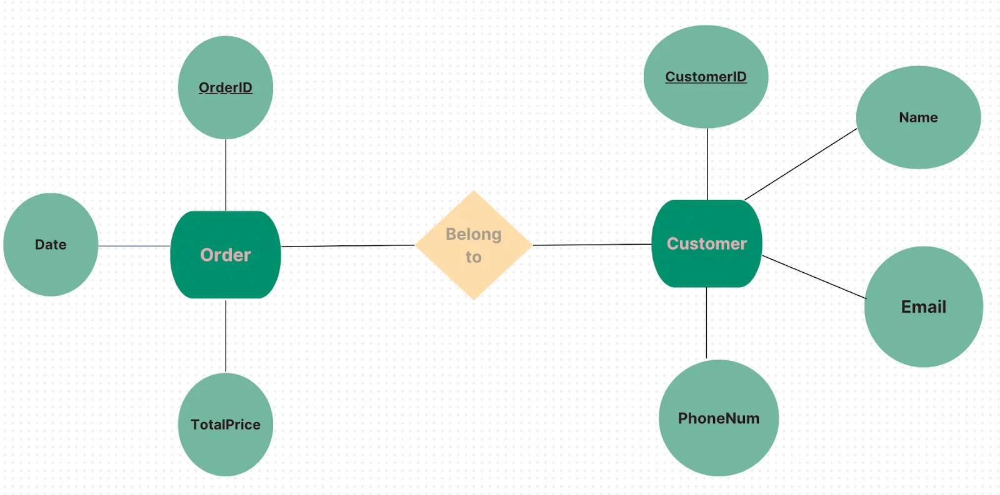

=> Việc sử dụng sơ đồ ERD giúp chúng ta nhìn thấy toàn cảnh cấu trúc cơ sở dữ liệu, đảm bảo rằng mọi yếu tố quan trọng đều được xem xét, mọi mối quan hệ giữa các thực thể được xác định rõ ràng và tổ chức một cách hợp lý và dễ quản lý.

#### 1.4.3. Thiết kế CSDL phần logic

- Ở bước này, đầu tiên chúng ta sẽ chuyển đổi sơ đồ ERD từ bước trước thành một mô hình dữ liệu logic cụ thể và có tổ chức. Để đảm bảo cấu trúc dữ liệu được tổ chức hợp lý và dễ quản lý, cần thực hiện một số bước sau:
  - Xác định các bảng và thuộc tính: Dựa trên các thực thể và mối quan hệ trong mô hình ERD, xác định rõ các bảng và các thuộc tính (hay các cột) của mỗi bảng. Việc này bao gồm liệt kê các thuộc tính quan trọng và cần thiết cho từng bảng, đảm bảo mỗi bảng phản ánh chính xác thông tin cần lưu trữ. Ví dụ, bảng Customer có các thuộc tính như CustomerID (khoá chính), Name, PhoneNum và Email. Đảm bảo các thuộc tính này đủ chi tiết để phục vụ cho các yêu cầu kinh doanh.
  - Xác định khóa chính (Primary Key): Khóa chính là trường dữ liệu duy nhất đại diện cho mỗi hàng trong bảng, đảm bảo tính duy nhất và không thay đổi theo thời gian. Trong trường hợp không có một trường dữ liệu nào tự nhiên có thể làm khóa chính, có thể sử dụng cột được tạo tự động với giá trị tự động tăng (AutoNumber) để đảm bảo tính duy nhất. Ví dụ, trong bảng Order có thể tạo một cột “OrderID” với giá trị tự động tăng để đại diện cho khóa chính.
  - Xác định khóa ngoại (Foreign Key): Khóa ngoại là trường dữ liệu trong một bảng tham chiếu đến khóa chính của một bảng khác, giúp thiết lập mối quan hệ giữa các bảng. Ví dụ, trong bảng Order, có thể có cột “CustomerID” là khóa ngoại tham chiếu đến khóa chính “CustomerID” trong bảng Customer.

=> Việc thiết kế logic cơ sở dữ liệu là bước quan trọng trong quy trình xây dựng cơ sở dữ liệu, đảm bảo rằng mọi thông tin cần thiết được tổ chức một cách hợp lý và dễ dàng truy xuất.

#### 1.4.4. Áp dụng các quy tắc chuẩn hóa:

- Chuẩn hoá là quá trình tối ưu hóa cấu trúc của cơ sở dữ liệu để đạt được hiệu suất tốt nhất và giảm thiểu sự dư thừa dữ liệu. Có ba cấp độ chuẩn hoá chính, được gọi là NF (Normal Forms) gồm 1NF, 2NF, 3NF

#### 1.4.5. Thiết kế cơ sở dữ liệu phần vật lý

- Đầu tiên, xác định rõ kiểu dữ liệu và các ràng buộc dữ liệu trong từng bảng
- Tiếp theo, tạo các bảng và thiết lập mối quan hệ giữa chúng: Điều này nhằm phản ánh đúng cấu trúc và mối liên hệ giữa các thực thể. Các quan hệ của bảng bao gồm:
  - Quan hệ 1-1
  - Quan hệ 1-N
  - Quan hệ N-N

---

### 1.5. 11 nguyên tắc thiết kế csdl

- Để quy trình thiết kế cơ sở dữ liệu (CSDL) diễn ra một cách suôn sẻ và tối ưu, cần lưu ý các nguyên tắc sau:
  - 1. Tránh sự trùng lặp: Thông tin trùng lặp trong một schema có thể gây ra nhiều vấn đề. Sự trùng lặp có thể dẫn đến sự không nhất quán và tăng không gian lưu trữ không cần thiết, làm ảnh hưởng đến hiệu suất truy vấn và các thao tác cập nhật dữ liệu.
  - 2. Khóa chính và Định danh duy nhất: Mỗi bảng phải có một khóa chính để đảm bảo tính duy nhất của mỗi bản ghi trong bảng và được sử dụng để thiết lập mỗi quan hệ với các bảng khác trong cơ sở dữ liệu.
  - 3. Xử lý giá Trị Null: Trong cơ sở dữ liệu quan hệ, giá trị null chỉ ra dữ liệu không biết, thiếu hoặc không áp dụng. Cần xác định mỗi cột trong bảng có hỗ trợ giá trị null hay không.
  - 4. Tính toàn vẹn: Đảm bảo rằng mọi giá trị trong cột khóa ngoại của một bảng phải tương ứng với một giá trị khóa chính trong bảng liên kết, nhằm bảo vệ tính nhất quán của dữ liệu liên kết.
  - 5. Tính nguyên tử: Phân tách những dữ liệu phức tạp thành các phần riêng biệt để tránh sự phức tạp và rối loạn trong quá trình cập nhật, thêm mới hoặc xóa dữ liệu.
  - 6. Chuẩn hóa: Áp dụng các bước chuẩn hóa để loại bỏ các hiện tượng bất thường trong quá trình thêm, cập nhật hoặc xóa dữ liệu.
  - 7. Loại dữ liệu phù hợp: Chọn loại dữ liệu phù hợp cho mỗi cột của mỗi bảng dựa trên định dạng và tính chất của thông tin được lưu trữ.
  - 8. Tạo Chỉ Mục (Indexing): Tạo các chỉ mục để tăng tốc độ truy vấn và tìm kiếm dữ liệu. Việc tạo chỉ mục thường được thực hiện trong quá trình bảo trì cơ sở dữ liệu.
  - 9. Phân vùng schema: Phân vùng schema lớn thành các phần nhỏ để dễ hiểu và quản lý. Lựa chọn tiêu chí phân vùng phụ thuộc vào nhu cầu của người thiết kế và người sử dụng cơ sở dữ liệu.
  - 10. Bảo mật dữ liệu: Đảm bảo chỉ những người được phép mới có thể truy cập, sửa đổi hoặc xem dữ liệu. Điều này có thể thực hiện thông qua việc sử dụng mã hóa, xác thực, kiểm soát quyền truy cập và giấu thông tin nhạy cảm.
  - 11. Sao lưu và phục hồi: Đảm bảo dữ liệu được sao lưu đều đặn và có thể khôi phục nhanh chóng trong trường hợp sự cố xảy ra như lỗi phần cứng, lỗi phần mềm… Điều này bao gồm việc thực hiện sao lưu toàn bộ dữ liệu cũng như các biện pháp như xác thực và kiểm tra sao lưu.

## 2. Lược đồ quan hệ ERD:

### 2.1. Vai trò của mô hình ERD trong quá trình thiết kế cơ sở dữ liệu:

- Mục tiêu của mô hình E-R trong quá trình thiết kế cơ sở dữ liệu đó là phân tích dữ liệu, xác định các đơn vị thông tin cơ bản cần thiết của tổ chức, mô tả cấu trúc và mối liên hệ giữa chúng

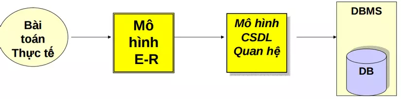

- E-R là mô hình trung gian để chuyển những yêu cầu quản lý dữ liệu trong thế giới thực thành mô hình cơ sở dữ liệu quan hệ

### 2.2. Các thành phần cơ bản của ERD

#### 2.2.1. Thực thể và tập thực thể

- Thực thể là một đối tượng trong thế giới thực.
- Một nhóm bao gồm các thực thể tương tự nhau tạo thành một tập thực thể
- Việc lựa chọn các tập thực thể là một bước vô cùng quan trọng trong việc xây dựng sơ đồ về mối quan hệ thực thể
- Ví dụ: “Quản lý các dự án của công ty”
  - Một nhân viên là một thực thể
  - Tập hợp các nhân viên là tập thực thể
  - Một dự án là một thực thể
  - Tập hợp các dự án là tập thực thể

#### 2.2.2. Thuộc tính:

- Mỗi tập thực thể có một tập các tính chất đặc trưng, mỗi tính chất đặc trưng này gọi là thuộc tính của tập thực thể. Ứng với mỗi thuộc tính có một tập các giá trị cho thuộc tính đó gọi là miền giá trị.
- Các loại giá trị của thuộc tính: + Đơn trị: các thuộc tính có giá trị duy nhất cho một thực thể (VD: số CMND, …) + Đa trị: các thuộc tính có một tập giá trị cho cùng một thực thể (VD: bằng cấp, …) + Suy diễn được (năm sinh <----> tuổi)
  => Mỗi thực thể đều được phân biệt bởi thuộc tính khóa

#### 2.2.3. ERD:

- Là đồ thị biểu diễn các tập thực thể, thuộc tính và mối quan hệ
- Ví dụ về ERD:

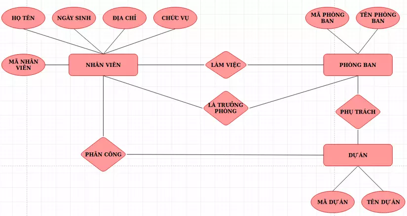

#### 2.2.4. Các kiểu liên kết trong ERD:

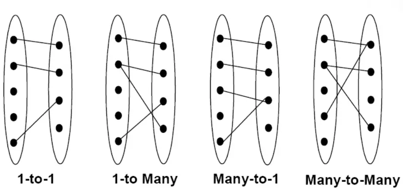

- Ví dụ:

  - Một phòng ban có nhiều nhân viên

  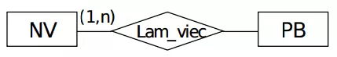

  - Một nhân viên chỉ thuộc 1 phòng ban:

  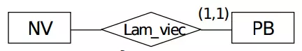

  - Một nhân viên có thể được phân công vào nhiều dự án hoặc không được phân công vào dự án nào đó:

  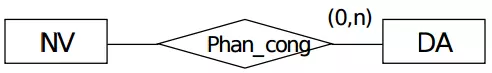

  - Một nhân viên có thể là trưởng phòng của 1 phòng ban nào đó

  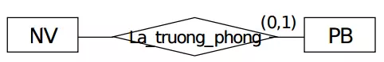

  - Một loại thực thể có thể tham gia nhiều lần vào một quan hệ với nhiều vai trò khác nhau

  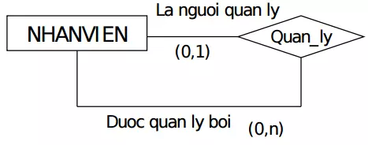

## 3. Mô hình dữ liệu quan hệ

### 3.1. Mô hình dữ liệu quan hệ là gì?

- Mô hình dữ liệu quan hệ bao gồm nhiều quan hệ (Relation). Các thực thể và thuộc tính trong mô hình ERD sẽ được chuyển đổi thành quan hệ và thuộc tính của chúng. Các mối quan hệ sẽ được biểu diễn bằng khoá ngoại.

Ví dụ: MON_HOC (MaMon, TenMon, SoTinChi)

### 3.2. Quy tắc chuyển đổi ERD sang mô hình DL quan hệ

- Tập thực thể: Các thực thể sẽ được chuyển đổi thành các quan hệ có cùng tên và danh sách thuộc tính tương ứng. Thuộc tính khoá sẽ trở thành khoá chính của quan hệ. Ví dụ, nếu chuyển đổi một tập hợp các thực thể.
  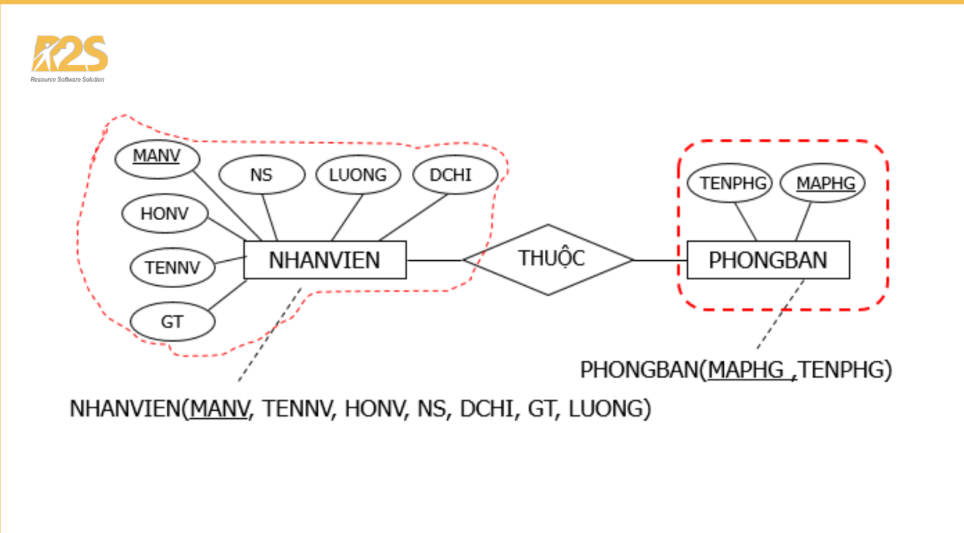

- Mối kết hợp 1 – 1: Khi một thuộc tính được sử dụng làm khoá ngoại cho bảng khác hoặc ngược lại, ta gọi đó là mối quan hệ 1-1. Dưới đây là một ví dụ về mối quan hệ này.
  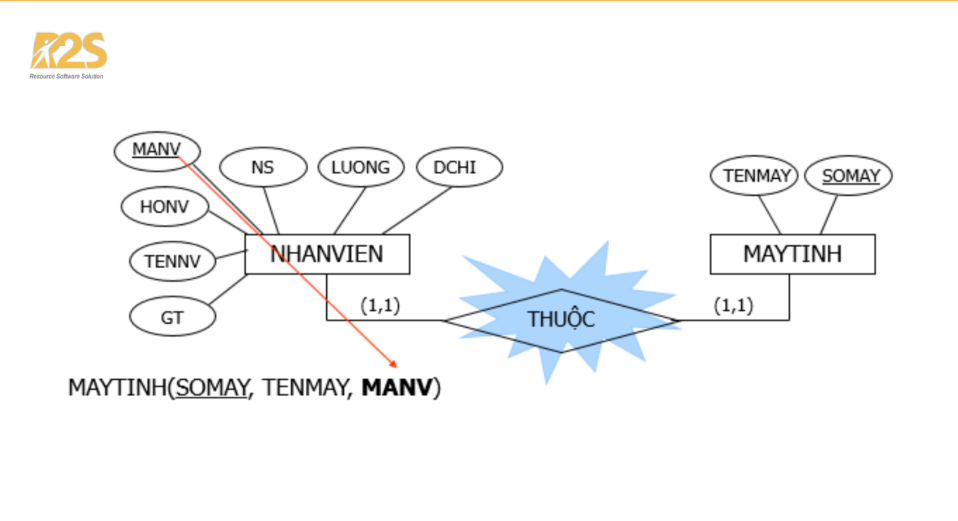

- Mối kết hợp 1 – N: Khoá ngoại bên nhiều được tạo bởi thuộc tính khoá bên 1. Dưới đây là ví dụ:
  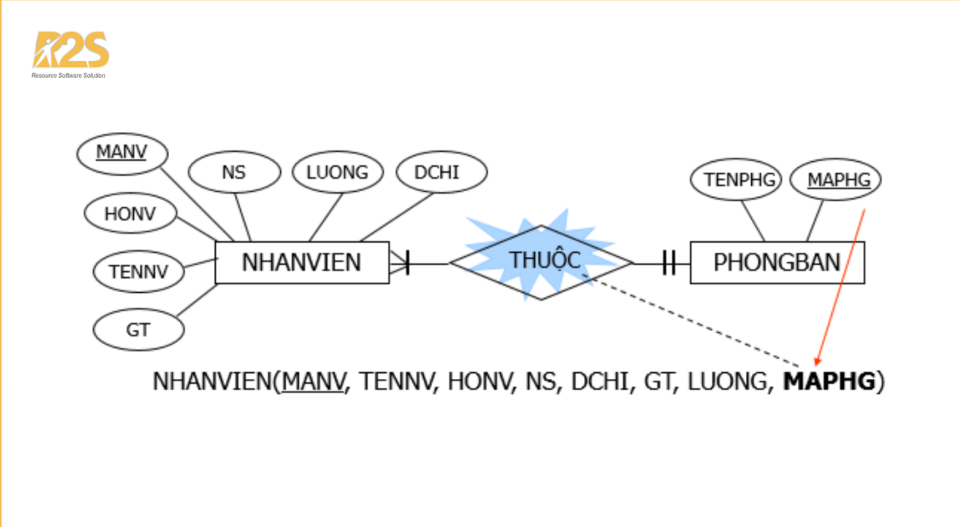

- Mối kết hợp N – N: Để chuyển sang quan hệ mới, ta cần tạo ra một khóa chính bao gồm hai thuộc tính khóa từ hai quan hệ khác nhau. Nếu có thuộc tính kết hợp, ta cũng sẽ đưa vào quan hệ mới như một thuộc tính. Ví dụ:
  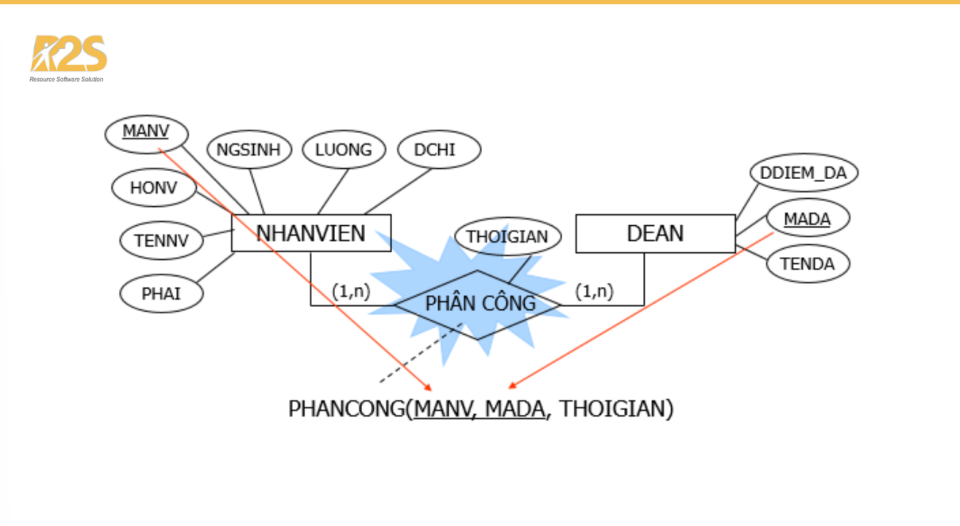

- Mối kết hợp 3 ngôi (Ba thực thể tham gia vào mối kết hợp): Để chuyển sang quan hệ mới, ta cần có một khoá chính bao gồm 3 thuộc tính khoá của 3 thực thể tham gia vào mối kết hợp. Nếu có thuộc tính mối kết hợp, ta sẽ đưa nó vào quan hệ mới. Ví dụ:
  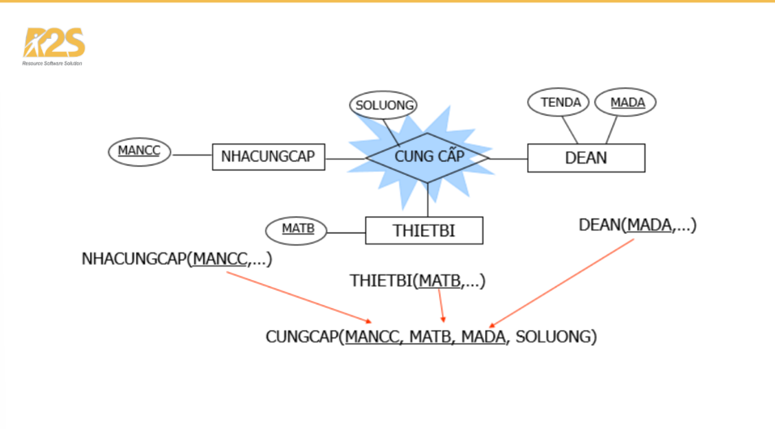

## 4. Chuẩn hóa dữ liệu: 1NF, 2NF, 3NF.

### 4.1. Chuẩn hóa dữ liệu là gì?

- Chuẩn hóa dữ liệu đề cập đến quá trình tổ chức và cấu trúc dữ liệu theo cách loại bỏ sự trùng lặp, đảm bảo tính nhất quán và giảm thiểu các biến đổi dữ liệu. Nó liên quan đến việc chia dữ liệu thành các bảng nhỏ hơn, có quan hệ logic với nhau, giảm thiểu sự lặp lại dữ liệu và thiết lập mối quan hệ giữa các bảng này thông qua các khóa.

### 4.2. Tại sao cần chuẩn hóa dữ liệu?

- Chuẩn hóa dữ liệu là vô cùng quan trọng vì các lý do sau đây:
  - 1. Loại bỏ sự trùng lặp: Bằng cách loại bỏ dữ liệu trùng lặp, chuẩn hóa giúp giảm yêu cầu lưu trữ, cải thiện hiệu suất truy xuất dữ liệu và giảm nguy cơ không nhất quán.
  - 2. Đảm bảo tính nhất quán: Chuẩn hóa cải thiện tính toàn vẹn dữ liệu bằng cách loại bỏ các tình huống không nhất quán có thể xảy ra khi dữ liệu được lưu trữ lặp đi lặp lại.
  - 3. Đơn giản hóa việc bảo trì: Bằng cách chia dữ liệu thành các bảng nhỏ hơn, có cấu trúc tốt, chuẩn hóa đơn giản hóa việc quản lý và bảo trì cơ sở dữ liệu.
  - 4. Hỗ trợ khả năng mở rộng: Cơ sở dữ liệu chuẩn hóa dễ dàng thích ứng với các sửa đổi, mở rộng và nâng cấp hệ thống trong tương lai.

### 4.3. Dạng chuẩn hóa đầu tiên 1NF:

- Dạng chuẩn hóa đầu tiên yêu cầu mỗi cột trong bảng chỉ chứa các giá trị nguyên tử (không thể phân tách), và không có nhóm dữ liệu lặp lại.
- Nói cách khác, mỗi thuộc tính của bảng phải chứa một giá trị duy nhất.
- Ví dụ: Bảng dữ liệu trước khi được chuẩn hóa 1NF

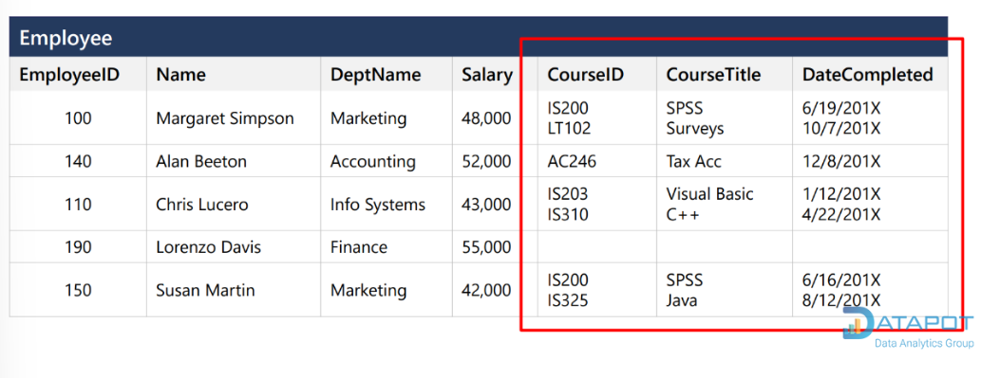

- Bảng dữ liệu sau khi được chuẩn hóa 1NF:

### 4.4. Dạng Chuẩn Hóa Thứ Hai (2NF)

- Dạng chuẩn hóa thứ hai xây dựng trên cơ sở của 1NF bằng cách loại bỏ các phụ thuộc một phần. Phụ thuộc một phần xảy ra khi một thuộc tính phụ thuộc vào chỉ một phần của khóa chính.
- Để đạt được 2NF, bảng nên được chia thành các bảng riêng biệt, trong đó mỗi thuộc tính phụ thuộc hoàn toàn vào toàn bộ khóa chính.
- Ví dụ:
  - Trong bảng Employee, các cột Name (Tên nhân sự), Dept_name (Tên phòng ban), Salary (Mức lương) phụ thuộc vào cột EmployeeID (Mã nhân sự).
  - Trong bảng Emp_Crs, các cột EmployeeID (Mã nhân sự), CourseID (Mã khóa học) và DateCompleted (Ngày hoàn thành khóa học) phụ thuộc vào cột ID.
  - Trong bảng Course (Khóa học), cột Course_Title (Tên khóa học) phụ thuộc vào cột Course_ID (Mã khóa học).

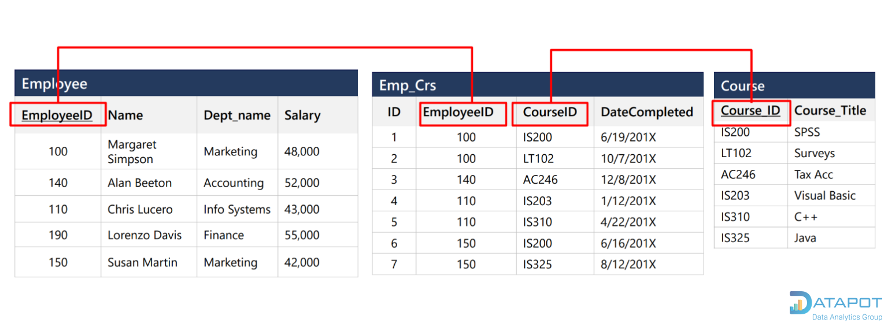

### 4.5. Dạng Chuẩn Hóa Thứ Ba (3NF)

- Dạng chuẩn hóa thứ ba tiếp tục cải thiện cấu trúc bảng bằng cách loại bỏ các phụ thuộc chuyển tiếp. Phụ thuộc chuyển tiếp xảy ra khi một thuộc tính phụ thuộc vào một thuộc tính khác không phải là khóa chính.
- Trong 3NF, các bảng được chia để loại bỏ các phụ thuộc này.
- Ví dụ: Bảng thông tin đơn hàng ở dưới chưa được chuẩn hóa 3NF, ta thấy có cột OrderID (Mã đơn hàng) là khóa chính nhưng các cột CustomerName (Tên khách hàng), CustomerCountry (Quốc gia của khách hàng) vẫn phụ thuộc vào cột khóa ngoại là CustomerID (Mã khách hàng).

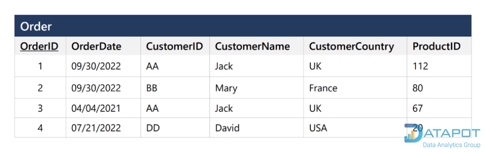

- Để chuẩn hóa 3NF, ta tách các cột chứa thông tin về khách hàng thành một bảng khác như sau:

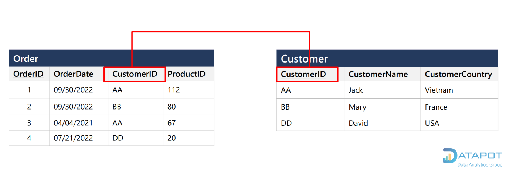
