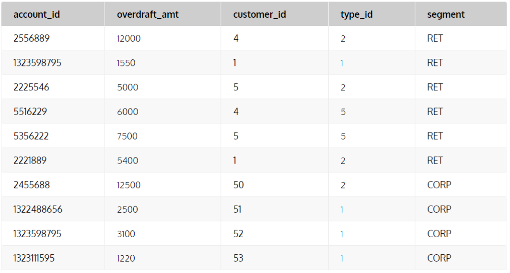
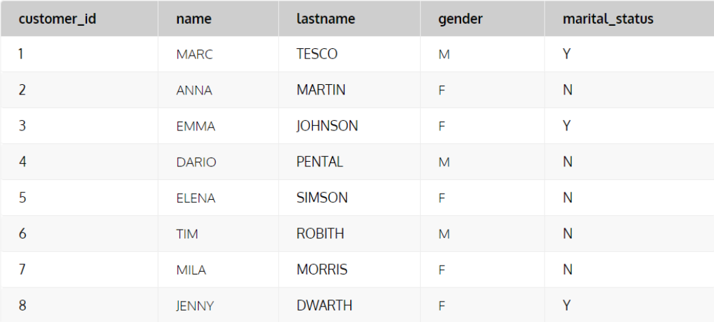
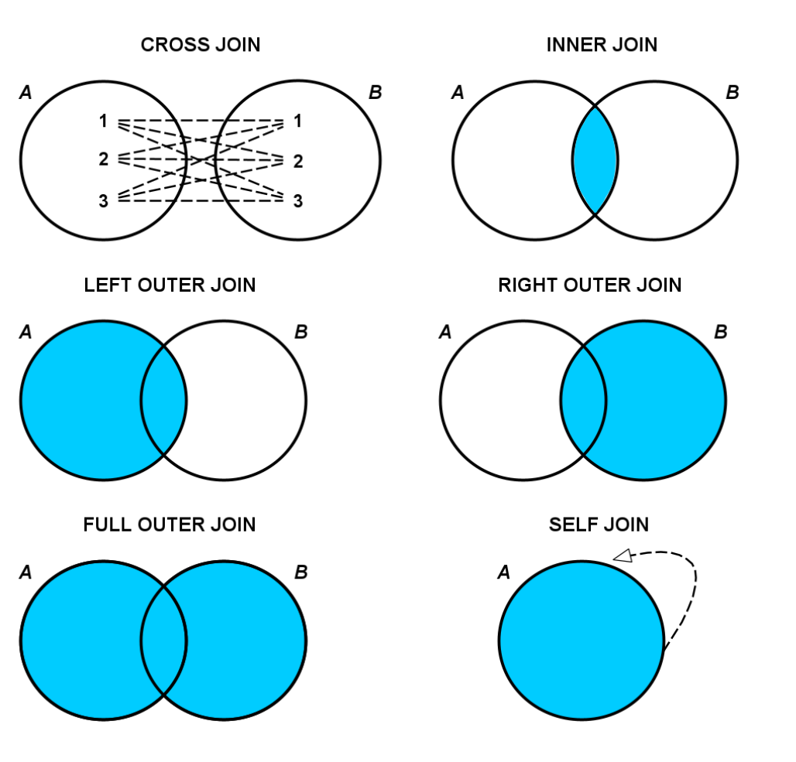

# Buổi 3: SQL cơ bản

## 1. Các thao tác cơ bản: SELECT, INSERT, UPDATE, DELETE, từ khóa AS, DISTINCT

### 1.1. SELECT

- SELECT được sử dụng để lấy dữ liệu từ một hoặc nhiều bảng trong cơ sở dữ

```sql
SELECT [cột1], [cột2], ...
FROM [tên_bảng]
WHERE [điều_kiện];
```

- Giải thích:

  - SELECT: chỉ định các cột cần lấy dữ liệu
  - FROM: chỉ ra bảng cần truy vấn
  - WHERE: lọc dữ liệu theo điều kiện

- Ví dụ:

```sql
SELECT first_name, last_name, salary
FROM employees
WHERE salary > 10000;
```

---

### 1.2. INSERT:

- Câu lệnh `INSERT` dùng để **chèn (thêm)** một hoặc nhiều bản ghi vào bảng
- Cú pháp:

```sql
INSERT INTO [Table] ([Cột1], [Cột2],...)
VALUES ([giá_trị1], [giá_trị2],...)
```

- Giải thích:

  - `INSERT INTO`: chỉ định bảng cần thêm dữ liệu
  - `VALUES`: chứa danh sách giá trị tương ứng với các cột

- Ví dụ:

```sql
INSERT INTO employees(first_name, last_name, years_of_experience)
VALUES ('Khanh', 'Tran', 2);
```

---

### 1.3. UPDATE

- câu lệnh `UPDATE` dùng để thay đổi giá trị của một hoặc nhiều cột trong các hàng dữ liệu thỏa mãn điều kiện
- Cú pháp:

```sql
UPDATE [tên_bảng]
SET [cột1] = [giá_trị_mới1], [cột2] = [giá_trị_mới2],...
WHERE [điều_kiện];
```

- Nếu không có `WHERE`, toàn bộ bảng sẽ bị cập nhật (khá nguy hiểm)

- Ví dụ:

```sql
UPDATE employees
SET salary = salary * 1.1
WHERE year_of_experience >= 2;
```

---

### 1.4. DELETE

- Câu lệnh `DELETE` dùng để xóa một hoặc nhiều bản ghi trong bảng
- Cú pháp:

```sql
DELETE FROM [tên_bảng]
WHERE [điều_kiện];
```

- Ví dụ:

```sql
DELETE FROM employees
WHERE year_of_experience <=1;
```

---

### 1.5. Từ khóa `AS`

- Dùng để đat tên tạm cho cột hoặc bảng trong truy vấn, giúp câu lệnh ngắn gọn và dễ đọc hơn
- Cú pháp:

```sql
SELECT [tên_cột] AS [bí_danh]
FROM [tên_bảng] AS [bí_danh];
```

- Ví dụ:

```sql
SELECT years_of_experience as "YoP"
FROM employees;
```

---

### 1.6. Từ khóa `DISTINCT`

- Dùng để loại bỏ các bản ghi trùng lặp trong truy vấn
- Cú pháp:

```sql
SELECT DISTINCT [tên_cột]
FROM [tên_bảng];
```

- Ví dụ:

```sql
SELECT DISTINCT department_id
FROM employees;
```

-> Lấy ra các danh sách phòng ban khác nhau trong table employees.

---

## 2. Lọc dữ liệu: WHERE, HAVING

### 2.1. WHERE

- Dùng để lọc các bản ghi trước khi thực hiện các phép tính như GROUP BY, SUM(), AVG(),...
- Cú pháp:

```sql
SELECT col,...
FROM table
WHERE condition;
```

- Ví dụ:

```sql
SELECT name, salary
FROM employees
WHERE salary > 2000;
```

### 2.2. Having

- Là một điều kiện được sử dụng sau mệnh đề GROUP BY. Nó được sử dụng để lọc các nhóm dữ liệu dựa trên hàm tính toán (aggregate function). Mục đích chính của `HAVING` là lọc các nhóm dữ liệu sau khi đã thực hiện tính toán
- Cú pháp:

```sql
SELECT col1, col2, Aggregate_fucction(col3)
FROM table
GROUP BY col1, col2
HAVING Aggregate_condition;
```

- Ví dụ:

```sql
SELECT department, AVG(salary) AS avg_salary
FROM employees
GROUP BY department
HAVING AVG(salary) > 10000;
```

## 3. JOIN và UNION

### 3.1. JOIN

- Được sử dụng để kết hợp dữ liệu từ nhiều bảng dữ liệu khác nhau. Bản ghi từ các bảng sẽ được kêt nối với nhau thông qua điều kiện giữa một hoặc nhiều cột có mối quan hệ trong bảng. Nếu đáp ứng điều kiện, bản ghi ở các bảng sẽ được kết nối với nhau thành một. Lưu ý: câu lệnh JOIN để kết nối dữ liệu giữa nhiều CỘT từ nhiều bảng khác nhau (khác với UNION kết hợp các HÀNG có cùng số cột giữa các bảng khác nhau)
- Giả sử, có hai bảng dữ liệu là bảng _account_ chứa các dữ liệu liên quan tới tài khoản ngân hàng của các khách hàng và bảng _customer_ chứa các dữ liệu liên quan tới khách hàng cá nhân.
- Trong đó:
- Bảng _account_ có 5 cột:
  - account_id
  - overdraft_amount: hạn mức chi tiêu của mỗi tài khoản
  - customer_id: id của khách hàng chủ tài khoản
  - type_id: ID của loại tài khoản
  - segment - phân loại tài khoản



- Bảng _customer_ có 5 cột:
  - customer_ID: ID của mỗi khách hàng
  - name: tên của khách hàng
  - lastname: họ của khách hàng
  - gender: giới tính
  - martial_status: tình trạng hôn nhân



=> Chúng ta có thể kết hợp dữ liệu từ hai bảng này để trả lời các câu hỏi như: + Chủ tài khoản các các tài khoản trong bảng _account_ là ai? + Một khách hàng (giả sử Marc Tesco) có mấy tài khoản? + Có bao nhiêu tài khoản được mở bởi khách hàng nữ? + Hạn mức chi tiêu của tất cả các tài khoản của một khách hàng là bao nhiêu?

#### 3.1.1. Các loại mệnh đề JOIN trong SQL

- Các loại mệnh đề JOIN khác nhau sẽ cho ra một kết quả khác nhau để đảm bảo không làm mất dữ liệu, dư thừa dữ liệu, hay khiến cho dữ liệu trở nên không chính xác khi kết hợp hai bảng với nhau



- INNER JOIN: trả về các bản ghi có giá trị thỏa mãn điều kiện JOIN trong cả hai bảng
- LEFT JOIN: Trả về tất cả các bản ghi từ bảng bên trái (table1) và mọi bản ghi phù hợp từ bảng bên phải (table2). Nếu không khớp, giá trị NULL sẽ được hiển thị cho các cột của bảng bên phải (table2)
- RIGHT JOIN: Trả về tất cả bản ghi từ bảng bên phải (table2) và mọi bản ghi phù hợp từ bảng bên trái (table1). Nếu không khớp, giá trị NULL sẽ được hiển thị cho các cột của bảng bên trái (table1).
- FULL JOIN: Trả về tất cả bản ghi trong cả hai bảng dù có khớp điều kiện JOIN hay không.
- CROSS JOIN: Trả về mọi tổ hợp các record từ cả hai bảng
- SELF JOIN: Trả về các record có giá trị khớp với điều kiện khi một bảng được JOIN với chính nó

- Cú pháp:

```sql
SELECT col1, col2,...
FROM table1 AS t1
[INNER/LEFT/RIGHT/FULL/CROSS] JOIN table2 AS t2
ON t1.common_column = t2.common_column;
```

- Trong đó:
  - col1, col2,.., là tên các cột muốn hiển thị
  - table1, table2,... là tên các bảng có chứa dữ liệu cần kết hợp
  - common_column là cột chung xuất hiện trong cả hai bảng và được sử dụng để thực hiện phép JOIN.

### 3.2. UNION

- dùng để gộp kết quả của 2 hoặc nhiều câu lệnh `SELECT` thành một tập kết quả duy nhất. Các bản ghi trùng nhau sẽ tự động bị loại bỏ (nếu muốn giữ trùng nhau thì dùng `UNION ALL`).
- Cú pháp:

```sql
SELECT col,...
FROM table1

UNION

SELECT col,...
FROM table2
```

-> Lưu ý: số lượng col trong các select phải **bằng nhau**, thứ tự và kiểu dữ liệu tương ứng giữa các cột phải tương thích

- Ví dụ:

```sql
SELECT name, city FROM table1
UNION
SELECT name,city FROM table2
```

---

## 4. COUNT, SUM, AVG, GROUP BY

### 4.1. COUNT

- dùng để đếm tổng số bản ghi trong bảng hoặc kết quả truy vấn.
- Cú pháp:

```sql
SELECT COUNT(*)
FROM table_name
WHERE condition;
```

- Ví dụ: đếm số lượng bản ghi có trong cột employee_ID

```sql
SELECT COUNT (employee_ID)
FROM employee
WHERE salary > 2000;
```

-> Công thức này đếm các giá trị của employee_ID không chưa giá trị NULL, nếu muốn đếm cả phần tử có NULL thì dùng câu lệnh:

```sql
SELECT COUNT(*) FROM employee;
```

### 4.2. SUM

- là hàm tổng hợp trong, được dùng để tính tổng giá trị của một cột số
- Cú pháp:

```sql
SELECT SUM(col)
FROM table_name
WHERE condition;
```

- Ví dụ: tính tổng lương của tất cả nhân viên

```sql
SELECT SUM(salary) AS total_salary
FROM employees;
```

- Ví dụ: tính tổng lương theo từng phòng ban

```sql
SELECT department_id, SUM(salary) as total_salary
FROM employees
GROUP BY department_id;
```

### 4.3. AVG

- dùng để tính giá trị trung bình của một cột số
- Cú pháp:

```sql
SELECT AVG(col)
FROM table_name
WHERE condition;
```

- Ví dụ: tính lương trung bình của tất cả nhân viên

```sql
SELECT AVG(salary) FROM employess;
```

- Ví dụ 2: tính lương trung bình theo phòng ban

```sql
SELECT department_id, AVG(salary) AS avg_salary
FROM employees
GROUP BY department_id;
```

---

### 4.4. GROUP BY

- được dùng để **gom nhóm dữ liệu** lại dựa trên một hoặc nhiều cột, thường kết hợp với hàm tổng hợp như sum, avg, count
- Cú pháp:

```sql
SELECT col1, aggregate_function(col2)
from table_name
where condition
group by col1;
```

- Ví dụ: tính lương trung bình theo phòng ban

```sql
SELECT department_id, AVG(salary) as avg_salary
FROM employees
GROUP BY department_id;
```

## 5. Truy vấn con subquery

- Là một truy vấn SQL lồng bên trong một truy vấn khác (gọi là outer query)
- Subquery thường được dùng để:

  - Lọc dữ liệu trong `WHERE`, `HAVING`
  - Tạo bảng tạm trong `FROM`
  - Gán giá trị cho `SELECT`
  - Kiểm tra sự tồn tại (`EXIST`, `IN`)

- Ví dụ:

```sql
SELECT name
FROM employees
WHERE salary > (
    SELECT AVG(salary)
    FROM employees
);
```

- Phân loại subquery:

| Loại                    | Đặc điểm                                                                     | Ví dụ                                                                                 |
| ----------------------- | ---------------------------------------------------------------------------- | ------------------------------------------------------------------------------------- |
| **Scalar subquery**     | Trả về đúng 1 giá trị                                                        | `salary > (SELECT AVG(salary) FROM employees)`                                        |
| **Row subquery**        | Trả về 1 dòng nhiều cột                                                      | `WHERE (col1, col2) = (SELECT x, y FROM ...)`                                         |
| **Table subquery**      | Trả về nhiều dòng, nhiều cột (dùng trong `IN`, `EXISTS`, `FROM`)             | `SELECT * FROM (SELECT ...) AS t`                                                     |
| **Correlated subquery** | Subquery có tham chiếu đến cột của truy vấn cha → phải chạy lại **mỗi dòng** | `WHERE salary > (SELECT AVG(salary) FROM employees e2 WHERE e2.dept_id = e1.dept_id)` |


## 6. Thứ tự thực thi logic của truy vấn SQL
- SQL thực thi theo thứ tự logic:

| Thứ tự | Mệnh đề          | Chức năng                             |
| :----: | :--------------- | :------------------------------------ |
|  **1** | `FROM`           | Lấy dữ liệu từ bảng hoặc view         |
|  **2** | `ON`             | Áp điều kiện nối (nếu có `JOIN`)      |
|  **3** | `JOIN`           | Kết hợp các bảng lại                  |
|  **4** | `WHERE`          | Lọc các hàng không thỏa mãn điều kiện |
|  **5** | `GROUP BY`       | Gom nhóm dữ liệu                      |
|  **6** | `HAVING`         | Lọc các nhóm sau khi tính toán        |
|  **7** | `SELECT`         | Chọn cột hoặc biểu thức cần hiển thị  |
|  **8** | `DISTINCT`       | Loại bỏ các dòng trùng lặp            |
|  **9** | `ORDER BY`       | Sắp xếp kết quả cuối                  |
| **10** | `LIMIT / OFFSET` | Giới hạn số dòng kết quả              |


```sql
select C.cname
from Company as C
join Product as P
on C.cname = P.manufacturer
where (C.country = 'Japan'
    And P.category in ('gadget', 'phôtgraphy'))
    Or (C.country = 'USA'
    And P.category in ('gadget'))
GROUP BY C.cname
HAVING COUNT(DISTINCT P.category) = 2;
```

```sql
select C.Cname
from Company as C
join Product as P
on C.cname = P.manufacturer
where C.country = 'USA'
    And P.category in ('gadget')
```