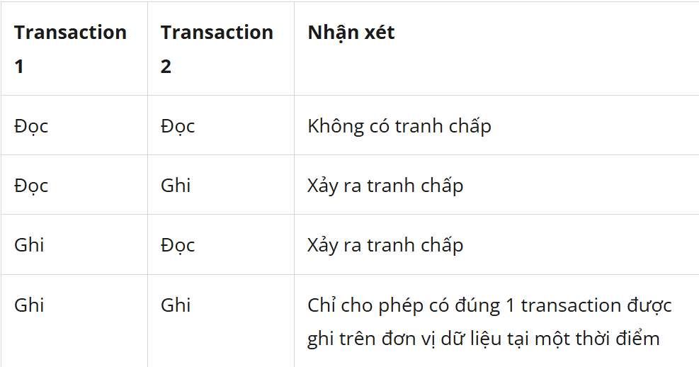

# Buổi 4: SQL nâng cao

## 1. Tối ưu hóa truy vấn

### 1.1. Chỉ chọn các cột cần thiết (SELECT)

- Một trong những cách đơn giản nhất để cải thiện hiệu suất của truy vấn SQL là chỉ chọn các cột cần thiết thay vì chọn tất cả. Thực hiện điều này giúp giảm dung lượng dữ liệu được trả về từ cơ sở dữ liệu, làm giảm tải cho mạng và tăng tốc độ truy vấn.
- Thay vì sử dụng SELECT \*, thì chỉ nên chọn các cột cần thiết như SELECT username, email FROM users

### 1.2. Sử dụng chỉ mục INDEX

- Chỉ mục index là một cách hiệu quả để tối ưu hóa truy vấn SQL. Bằng cách tạo chỉ mục trên các cột thường xuyên được truy vấn, bạn có thể cải thiện tốc độ truy vấn đáng kể.
- Ví dụ: tạo chỉ mục trên cột email trong bảng users để cải thiện tốc độ truy vấn khi thường xuyên tìm kiếm theo email.

### 1.3. Thận trọng khi dùng JOIN

- JOIN là một phần không thể thiếu trong việc truy vấn dữ liệu từ nhiều bảng. Tuy nhiên, việc sử dụng JOIN không đúng cách có thể làm giảm hiệu suất của truy vấn. Sử dụng INNER JOIN khi cần lấy dữ liệu từ hai bảng có quan hệ một-một, và sử dụng LEFT JOIN khi cần lấy dữ liệu từ bảng chính và có hoặc không có dữ liệu từ bảng thứ cấp.
- Ví dụ: Sử dụng INNER JOIN để kết hợp dữ liệu từ bảng orders và bảng customers khi cần lấy thông tin về đơn hàng và thông tin về khách hàng tương ứng.

### 1.4. Sử dụng EXISTS hoặc IN thay vì JOIN

- Trong một số trường hợp, sử dụng EXISTS hoặc IN có thể nhanh hơn và tối ưu hơn so với việc sử dụng JOIN, đặc biệt là khi bạn chỉ cần kiểm tra sự tồn tại của dữ liệu trong một bảng con.
- Ví dụ: Sử dụng EXISTS để kiểm tra xem có dữ liệu phù hợp trong một bảng con hay không.

```sql
SELECT * FROM orders
WHERE EXISTS (SELECT 1 FROM customers WHERE customers.id = orders.customer_id);
```

### 1.5. Tối ưu hóa cấu trúc bảng:

- Thiết kế cấu trúc bảng đúng cách có thể đóng vai trò quan trọng trong việc cải thiện hiệu suất của cơ sở dữ liệu. Tránh lặp lại dữ liệu và thiết kế bảng sao cho phản ánh đúng quan hệ giữa các thực thể có thể giúp tối ưu hóa hiệu suất của truy vấn.
- Ví dụ: Thay vì lưu trữ thông tin khách hàng trong mỗi bản ghi đơn hàng, có thể tạo một bảng riêng cho thông tin khách hàng và tham chiếu đến nó từ bảng đơn hàng.

### 1.6. Thực hiện partitioning

- Partitioning là một kỹ thuật mạnh mẽ để tối ưu hóa hiệu suất của cơ sở dữ liệu, đặc biệt là khi bạn có một bảng lớn chứa dữ liệu lịch sử. Bằng cách chia dữ liệu thành các phần nhỏ dựa trên các tiêu chí như thời gian, bạn có thể cải thiện tốc độ truy vấn và quản lý dữ liệu hiệu quả hơn.
- Ví dụ: Sử dụng partitioning để chia dữ liệu lịch sử thành các phần nhỏ dựa trên thời gian.

### 1.7. Giảm thiểu sử dụng DISTINCT

- DISTINCT là một câu lệnh hữu ích khi bạn cần lấy giá trị duy nhất từ một cột. Tuy nhiên, việc sử dụng DISTINCT có thể tốn nhiều tài nguyên và ảnh hưởng đến hiệu suất của truy vấn.
- Ví dụ: Giảm thiểu sử dụng DISTINCT và xem xét cách khác để loại bỏ các bản sao từ kết quả truy vấn.

### 1.8.Sử dụng ORDER BY khi cần thiết

- Sử dụng ORDER BY để sắp xếp kết quả truy vấn là một cách hiệu quả để tổ chức dữ liệu trả về. Tuy nhiên, việc sắp xếp dữ liệu có thể tốn nhiều tài nguyên nếu không được thực hiện đúng cách.
- Ví dụ: Sử dụng ORDER BY để sắp xếp kết quả truy vấn theo một cột cụ thể như ORDER BY date_created.

## 2.Index trong SQL

### 2.1. Index là gì?

- Index (hay chỉ mục) là một cấu trúc dữ liệu để tăng hiệu suất truy vấn của cơ sở dữ liệu. Index cho phép cơ sở dữ liệu thực hiện một số câu truy vấn có điều kiện nhanh hơn so với thông thường. Nhưng index cũng được lưu trên bộ nhớ và tiêu tốn không gian bộ nhớ và thời gian để tạo, cập nhật index nên khi sử dụng index cần phải suy xét kĩ.

### 2.2. Khi nào sử dụng index?

- Index giúp tăng tốc độ truy vấn của một số câu lệnh select có điều kiện vì vậy nó đặc biệt hữu dụng khi câu lệnh truy vấn được sử dụng thường xuyên (hoặc cột được tạo index thường được truy vấn) và số lượng bản ghi lớn.
- Khó để xác định khi nào sử dụng index, nó phụ thuộc nhiều vào các bài toán thực tế tuy nhiên có một số quy luật thường thấy khi chọn một cột (hoặc tập các cột) để tạo index:

1. Khóa và các cột có giá trị độc nhất (unique): Database thường sẽ tự động tạo index cho các cột này nên để tranh việc trùng lặp và tiêu tốn bộ nhớ ta không nên tạo thêm index cho chúng.
2. Tần suất được sử dụng: Khi tần suất sử dụng câu truy vấn càng lớn thì việc tạo index sẽ giúp làm giảm càng nhiều thời gian truy vấn (tính tổng).
3. Số lượng bản ghi của bảng: Số lượng bản ghi của bảng càng nhiều thì tốc độ truy vấn sẽ càng giảm lợi thế của việc sử dụng index trên các bảng này lại càng rõ ràng so với những bảng có số lượng bản ghi ít. Đặc biệt đối với trường hợp một bảng có ít bản ghi (100 - vài nghìn) ta không nên tạo chỉ mục cho chúng.
4. Dữ liệu của bảng tăng trưởng nhanh: Index sẽ tự động cập nhật khi có một bản ghi được thêm vào cơ sở dữ liệu, vì vậy khi đánh chỉ mục cho 1 bảng nó sẽ làm chậm lại các hành động thêm sửa xóa bản ghi. Vậy nên một bảng thường xuyên được cập nhật nên có ít index hơn một bảng hiếm khi cập nhật.
5. Không gian bộ nhớ: Khi tạo index sẽ sử dụng chính không gian bộ nhớ của cơ sở dữ liệu nên khi cơ sở dữ liệu có kích thước lớn ta cần lựa chọn cẩn thận trường nào sẽ sử dụng làm index.
6. Dữ liệu có đa dạng giá trị: Index được tạo dựa trên các giá trị trong cột mà nó trỏ tới ví dụ như cột index được tạo chỉ có 3 giá trị A, B, C thì index được tạo sẽ có giá trị nhỏ hơn nhiều so với cột có dải giá trị trải dài cả bảng chữ cái. Index trên cột có ít giá trị ví dụ cột sex sẽ không làm tăng nhiều tốc độ truy vấn tuy nhiên đối với những cột có nhiều giá trị riêng biệt như cột name sẽ làm tăng tốc độ truy vấn đáng kể.

### 2.3. Ưu điểm của việc sử dụng index.

- Thường sẽ làm tăng hiệu năng truy vấn khi điều kiện rơi vào các cột được đánh chỉ mục.
- Giúp ta có thể truy vấn dữ liệu nhanh hơn.
- Có thể được sử dụng để sắp xếp dữ liệu.
- Các chỉ mục độc nhất đảm bảo tính duy nhất của trường trong cơ sở dữ liệu.

### 2.4. Nhược điểm của sử dụng index

- Làm giảm hiệu năng các câu lệnh insert, update ,delete.
- Chiếm dụng bộ nhớ.

### 2.5. Cách tạo index

#### 2.5.1. Tạo index khi tạo bảng

```sql
CREATE TABLE users (
  id INT AUTO_INCREMENT PRIMARY KEY,
  name VARCHAR(100),
  email VARCHAR(100),
  INDEX (name)
);
```

#### 2.5.2. Thêm index sau khi bảng đã tồn tại

```sql
CREATE INDEX idx_name ON users(name);
```

#### 2.5.3. Thêm index bằng ALTER TABLE

```sql
ALTER TABLE users ADD INDEX idx_email (email);
```

## 3. Khái niệm Transaction, ACID, dirty read, dirty write

- Transaction (giao dịch) là một nhóm các câu lệnh SQL (như INSERT, UPDATE, DELETE) được thực thi như một đơn vị logic duy nhất.
  - Nếu tất cả câu lệnh trong nhóm thành công, ta xác nhận (COMMIT).
  - Nếu một câu lệnh lỗi, ta hoàn tác (ROLLBACK) toàn bộ thay đổi.
- Mục đích của Transaction:
  - Đảm bảo toàn vẹn dữ liệu khi có lỗi, mất điện, crash, hoặc truy cập đồng thời
  - Tránh tình trạng dữ liệu bị sai lệch, ví dụ trong giao dịch ngân hàng
- Một transaction đòi hỏi phải có 4 tính chất ACID. AcID là viết tắt của cụm từ Atomicity(nguyên tử), Consitency (nhất quán), Isolation (Cô lập), và Durability (Lâu bền).

  - Atomicity: Mọi thay đổi về mặt dữ liệu phải được thục hiện trọn vẹn khi transaction thực hiện thành công hoặc không có bất kì sự thay đổi nào về mặt dữ liệu nếu có xẩy ra sự cố.
  - Consistency: Sau khi một transaction kết thúc thì tất cả dữ liệu phải được nhất quán dù thành công hay thất bại.
  - Isolation: Các transaction khi đông thời thực thi trên hệ thống thì không có bất kì ảnh hưởng gì tời nhau.
  - Durability: Sau khi một transaction thành công thì tác dụng mà nó tạo ra phải bền vững trong cơ sở dữ liệu cho dù hệ thống có xẩy ra lỗi.

- Cấu trúc transaction được định nghĩa dựa trên:

  - BEGIN TRANSACTION: Bắt đầu một transaction
  - SAVE TRANSACTION: Đánh dấu vị trí trong transaction(điểm đánh dấu)
  - ROLLBACK TRANSACTION: Quay lui lại đầu transaction hoặc điểm đánh dấu trước đó trong transaction.
  - COMMIT TRANSACTION: Đánh dấu điểm kết thúc của một transaction, khi câu lệnh này thực thi có nghĩa là transaction thực hiện thành công.
  - ROLLBACK WORK: Quay lui lại đầu transaction.
  - COMMIT WORK: Đánh dấu kết thúc transaction.

- Ví dụ nâng cao - xử lý lỗi trong transaction:

```sql
START TRANSACTION;

UPDATE accounts SET balance = balance - 100 WHERE id = 1;
UPDATE accounts SET balance = balance + 100 WHERE id = 2;

-- Kiểm tra nếu có lỗi
IF (SELECT balance FROM accounts WHERE id = 1) < 0 THEN
  ROLLBACK;
ELSE
  COMMIT;
END IF;
```

- Vấn đề khi có hai transaction cùng hoạt động: Cùng một lúc, DB có thể được truy cập bởi nhiều clients. Nếu các clients cùng truy xuất vào một phần dữ liệu, thì sẽ nảy sinh các vấn đề liên quan đến tình trạng tranh chấp.Để giải quyết các vấn đề tranh chấp nêu trên, hệ quản trị cơ sở dữ liệu cần sử dụng các phương thức khóa, nhờ vậy mà khi có tranh chấp xảy ra hệ quản trị cơ sở dữ liệu có thể quyết định transaction nào được thực hiện và transaction nào phải chờ.



- Trong môi trường truy xuất đồng thời, có thể xảy ra một số vấn đề:
  - Mất dữ liệu cập nhật (Dirty Write): Tình trạng này xảy ra khi có nhiều hơn một giao tác cùng thực hiện cập nhật trên 1 đơn vị dữ liệu. Khi đó, tác dụng của giao tác cập nhật thực hiện sau sẽ đè lên tác dụng của thao tác cập nhật trước.
  - Đọc dữ liệu chưa commit(Uncomitted dât, Dirty read): Xảy ra khi một giao tác thực hiện đọc trên một đơn vị dữ liệu mà đơn vị dữ liệu này đang bị cập nhật bởi một giao tác khác nhưng việc cập nhật chưa được xác nhận.
