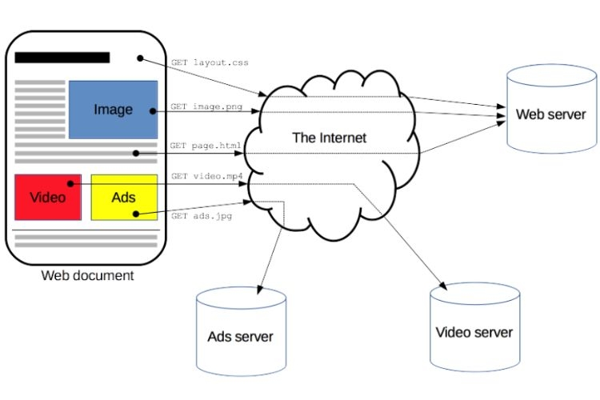
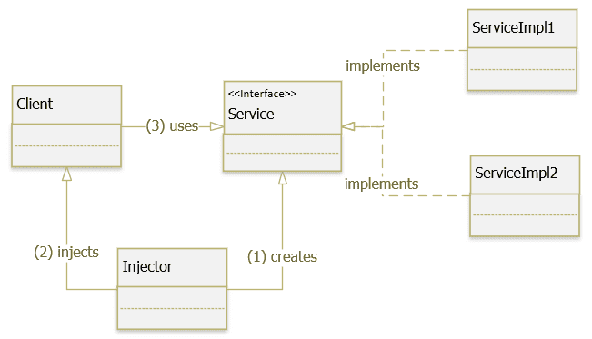

# Buổi 5

## 1. HTTP là gì ?

### 1.1. HTTP là gì?

- là viết tắt của Hyper Text Transfer Protocol, giao thức truyền tải siêu văn bản,giúp các máy tính có thể giao tiếp với nhau qua mạng.
- là nền tảng của WWW kết nối giữa server và client trong cùng 1 hệ thống mạng, cho phép truy cập vào các trang web, tải xuống các file, xem các hình ảnh, video. Ban đầu được thiết kế vào những năm 90, HTTP là một giao thức linh hoạt có khả năng mở rộng theo thời gian. Giao thức HTTP hoạt động trên nền tảng TCP/IP và thường được truyền qua kết nối mã hóa TLS để bảo vệ dữ liệu.
- Với **khả năng mở rộng đa dạng**, HTTP không chỉ được sử dụng để tải các tài liệu siêu văn bản mà còn để truyền tải hình ảnh, video và thậm chí đăng tải nội dung lên server, chẳng hạn như kết quả biểu mẫu HTML. HTTP cũng có thể sử dụng để tải lên các phần của trang web, giúp cập nhật nội dung theo yêu cầu.
- HTTP được sử dụng rộng rãi trong việc truy cập trang web trên Internet. Khi nhập địa chỉ 1 trang web vào trình duyệt, web server sẽ trả về một phản hồi (response) HTTP mã chứa HTML của trang web đó. Sau đó, trình duyệt sẽ đọc mã HTML rồi hiển thị trang web cho mình xem. Chúng ta có thể kiểm tra Request và Response HTTP bằng cách sử dụng công cụ kiểm tra mạng của trình duyệt.



---

### 1.2. Ba đặc điểm quan trọng của HTTP

#### 1.2.1. Tính đơn giản của HTTP

- Giao thức HTTP được thiết kế với sự đơn giản và thân thiện với người đọc. Bằng cách này việc đọc và hiểu các thông điệp HTTP (HTTP message) trở nên dễ dàng hơn, cung cấp khả năng kiểm thử cao hơn cho các nhà phát triển và giảm độ phức tạp với người mới sử dụng

#### 1.2.2. Khả năng mở rộng của HTTP

- Tính năng header HTTP đã tạo điều kiện thuận lợi cho việc mở rộng và thử nghiệm giao thức. Các chức năng mới có thể dễ dàng được giới thiệu thông qua thỏa thuận đơn giản giữa client và server về ý nghĩa của một header mới

#### 1.2.3. TÍnh stateless nhưng không phải sessionless của HTTP

- HTTP được xem là stateless, mỗi Request được gửi từ client tới server là độc lập hoàn toàn, server sẽ không nhwos bất kì thông tin nào về các request trước đó. Nhưng HTTP không phải sessionless bởi vì HTTP có hỗ trợ việc duy trì session một các gián tiếp thông qua các cơ chế như (Cookie, Token,...). Nhờ các kĩ thuật này, ứng dụng web có thể gắn kết các Request riêng lẻ thành 1 phiên làm việc (session) của người dùng.
- Ví dụ: Stateless (có session)

```bash
POST /login
-> trả về token: abc123
GET /profile (kèm token abc123)
GET /message (kèm token abc123)
```

---

### 1.3. Cấu trúc cơ bản của HTTP:

- HTTP là một giao thức Request-Response được xây dựng trên cơ sở cấu trúc Client-Server. Trong cấu trúc này, Client thường là trình duyệt web và Server giao tiếp bằng cách trao đổi các message độc lập thay vì sử dụng một luồng dữ liệu duy nhất. Các Request là message được gửi bởi Client và các Response là message được gửi bởi Server.

---

### 1.4. Các lỗi thường gặp khi duyệt giao thức HTTP là gì?

- Lỗi `404: Not found`: Trong quá trình duyệt giao thức HTTP, người dùng thường gặp phải một số lỗi phổ biến . Một trong những lỗi gặp thường xuyên là "404 Not Found", xuất hiện khi trình duyệt không thể tìm thấy tài nguyên được yêu cầu trên server. Điều này có thể xảy ra do đường dẫn không chính xác hoặc tệp không tồn tại

- Lỗi `500 Internal Server Error`: Lỗi thường xuất hiện khi server gặp sự cố nội bộ khi xử lý yêu cầu. Điều này có thể do lỗi lập trình, cấu hình server không đúng hoặc các vấn đề khác liên quan đến phía máy chủ.
- Lỗi `403 Forbidden`: là lỗi khi mình không có quyền truy cập vào một trang web hoặc một tài nguyên nào đó trên máy chủ web. Tuy nhiên, mình có thể thử làm mới trang, xóa bộ nhớ cache và cookie, và ngắt kết nối với bất kì VPN nào mình có thể đang sử dụng. Lỗi `403 Forbidden` có thể xảy ra do một số nguyên nhân như: Cấu hình file .htaccess sai, phân quyền file hoặc folder bị sai

## 2. Các method trong HTTP

- Có 9 loại Request, get và post là 2 loại thông dụng được sử dụng nhiều:

  - `GET`: được sử dụng để lấy thông tin từ server theo url đã cung cấp
  - `HEAD`: giống với GET nhưng response trả về không có body, chỉ có header
  - `POST`: gửi thông tin tới server thông qua các biểu mẫu http
  - `PUT`: ghi đè tất cả thông tin của đối tượng với những gì được gửi lên
  - `PATCH`: ghi đè các thông tin được thay đổi của đối tượng
  - `DELETE`: xóa tài nguyên trên server
  - `CONNECT` :thiết lập một kết nối tới server theo url
  - `OPTIONS`: mô tả các tùy chọn giao tiếp cho resource
  - `TRACE`: thực hiện một bài test loop-back theo đường dẫn tới resource

- `SAFE`: một method được coi là safe khi nó không làm thay đổi trạng thái (state) của server. Hay safe là chỉ đọc mà không làm thay đổi bất kì điều gì

  - Safe method: GET, HEAD và OPTIONS
  - Unsafe method: POST, PUT, PATCH, DELETE

- `IDEMPOTENT`: được cọi là idempotent khi có thể thực hiện n+1 lần mà vẫn trả lại kết quả như ban đầu => các safe method cũng được coi là idempotent

## 3. Response là gì, Request là gì ?

- Cấu trúc chung của Request/Response có 4 thành phần:
  - Dòng đầu tiên (một dòng): Cho biết thông tin yêu cầu hoặc trạng thái (thành công hay lỗi) của response.
  - Phần header (các dòng sau dòng đầu tiên trước một dòng trắng): Nó là một tập hợp các dòng chứa thông tin về HTTP Message, thông tin về phần body
  - Một dòng trắng cho biết phần thông tin (dòng đầu và header) đã gửi hết
  - Phần body chứa dữ liệu đính kèm với request (như HTML Form) hoặc nội dung văn bản đính kèm cùng response. Kích cỡ dữ liệu này (size) có được xác định bởi thông tin trong header.

### 3.1. HTTP Request

- Để bắt đầu trao đổi dữ liệu, phía client khỏi tạo một HTTP session bằng cách mở một kết nối TCP đến HTTP server sau đó gửi request đến server này. Request được tạo bằng nhiều cách, trực tiếp khi người dùng nhấp vào một liên kết trên trình duyệt hoặc gián tiếp, ví dụ như một video được đính kèm trong một website và việc request đến website này sẽ dẫn đến một request tới video ấy

- Bắt đầu của một HTTP request gồm 3 thông tin:
  - Method:GET, POST,....
  - URL: là địa chỉ định danh của tài nguyên
  - HTTP version: phiên bản HTTP đang sử dụng
- Tiếp theo là các trường request-header, cho phép client gửi thêm thông tin bổ sung về thongo điệp HTTP request và về chính client. Một số trường thông dụng như:
  - Accept: loại nội dung có thể nhận được từ thông điệp response (text/plain,....)
  - Connetion: tùy chọn điều khiển cho kết nối hiện thời
  - Cookie: thông tin HTTP Cookie từ server
  - User-Agent: thông tin về user agent của người dùng

### 3.2. HTTP Response

- Cấu trúc HTTP response gần giống với HTTP request, chỉ khác nhau là thay vì Request-line thì HTTP response có Status-Line. Status-Line có 3 phần:
  - HTTP-version: phiên bản HTTP cao nhất mà server hỗ trợ
  - Status-Code: mã kết quả trả về
  - Reason-Phrase: mô tả về Status-Code

#### 3.2.1. HTTP Status Code:

- 1xx: information Message: các status code này chỉ có tính chất tạm thời, client có thể không quan tâm.

- 2xx Successful: khi đã xử lý thành công request của client, server trả về status dạng này:

  - 200 OK: request thành công.
  - 202 Accepted: request đã được nhận, nhưng không có kết quả nào trả về, thông báo cho client tiếp tục chờ đợi.
  - 204 No Content: request đã được xử lý nhưng không có thành phần nào được trả về.
  - 205 Reset: giống như 204 nhưng mã này còn yêu câu client reset lại document view.
  - 206 Partial Content: server chỉ gửi về một phần dữ liệu, phụ thuộc vào giá trị range header của client đã gửi.

- 3xx Redirection: server thông báo cho client phải thực hiện thêm thao tác để hoàn tất request:

  - 301 Moved Permanently: tài nguyên đã được chuyển hoàn toàn tới địa chỉ Location trong HTTP response.
  - 303 See other: tài nguyên đã được chuyển tạm thời tới địa chỉ Location trong HTTP response.
  - 304 Not Modified: tài nguyên không thay đổi từ lần cuối client request, nên client có thể sử dụng đã lưu trong cache.

- 4xx Client error: lỗi của client:

  - 400 Bad Request: request không đúng dạng, cú pháp.
  - 401 Unauthorized: client chưa xác thực.
  - 403 Forbidden: client không có quyền truy cập.
  - 404 Not Found: không tìm thấy tài nguyên.
  - 405 Method Not Allowed: phương thức không được server hỗ trợ.

- 5xx Server Error: lỗi của server:
  - 500 Internal Server Error: có lỗi trong quá trình xử lý của server.
  - 501 Not Implemented: server không hỗ trợ chức năng client yêu cầu.
  - 503: Service Unavailable: Server bị quá tải, hoặc bị lỗi xử lý.

## 4. API là gì, RestAPI là gì ?

### 4.1. API:

- API là giao diện lập trình phần mềm trung gian hỗ trợ các ứng dụng giao tiếp với nhau. API (Application Programming Interface) hay còn gọi là giao diện lập trình ứng dụng, cho phép các ứng dụng khác giao tiếp hiệu quả với nhau và dùng được cho web-based system, operating system, database system, computer hardware, hoặc software library
- Vai trò của API:

  - API là phương tiện kết nối giữa các chương trình và hệ điều hành. Mỗi hệ điều hành có API khác nhau, phục vụ cho những mục đích khác nhau và không hề có tính tương thích. Có thể thấy Windows có rất nhiều API và Twitter cũng có riêng web API, tuy nhiên các API này hoàn toàn khác biệt.
  - API cung cấp khả năng truy xuất đến tập hợp các hàm hay dùng. Nói cách khác, API là một công cụ để tạo ra phần mềm. Lập trình viên có thể tự tạo ra các API hoặc mua từ các nhà cung cấp. HIện này, để đơn giản hóa lập trình web, hệ điều hành Microsoft đã cho ra đời công nghệ API web cho phép xây dựng dịch vụ thành phần mềm phân tán. Web API là mô hình được tạo ra nhằm mục đích hỗ trợ MVC như: routing, controller,... Đồng thời cung cấp tính năng cho phép restful đầy đủ các phương thức: get/post/put/delete dữ liệu

- Ưu điểm của API:
  - Cho phép kết nối mọi lúc mọi nơi nhờ Internet
  - Cần xác nhận trong các giao địch giao tiếp song phương
  - Tăng độ tin cậy của thông tin nhờ vào giao tiếp hai chiều
  - Mã nguồn mở
- API hiện đại:
  - tuân thủ theo các chuẩn (thông thường là HTTP và REST),dễ hiểu, giúp người dùng dễ sử dụng và truy cập

### 4.2. RestAPI:

- là nhưng API đi theo cấu trúc của Rest và chúng tồn tại theo những quy luật sau:
  - Tính nhất quán
  - Tồn tại ở trnajg thái mang tên "không trạng thái" (không có server-side session)
  - Trong trường hợp cần thiết có thể sử dụng HTTP status code
  - Có thể sử dụng cả URL endpoint với Logical hierarchy
  - Versioning không phải trong HTTP header mà trong URL
- Rest rất được ưa chuộng cho dữ liệu HTTP vì chúng có kích thước nhỏ gọn. Hiện nay, Rest rất phổ biến trên các website và được đánh giá là lựa chọn lý tưởng số 1 đối với việc phát triển API.

## 5. Design pattern

### 5.1. Design pattern là gì?

- là các giải pháp tổng thể đã được tối ưu hóa, được tái sử dụng cho các vấn đề phổ biến trong thiết kế phần mềm mà chúng ta thường gặp hằng ngày. Đây là các tập giải pháp đã được suy nghĩ, đã giải quyết trong tình huống cụ thể
- Các dev có thể áp dụng giải pháp này để giải quyết các vấn đề tương tự

### 5.2. Tại sao phải sử dụng Design Pattern?

- Giúp sản phẩm linh hoạt, dễ thay đổi và bảo trì hơn
- Có một điều luôn xảy ra trong phát triển phần mềm, là sự thay đổi về yêu cầu. Lúc này hệ thống phình to, các tính năng mới được thêm vào trong khi performance cần được tối ưu hơn
- DP cung cấp nhưng giải pháp đã được tối ưu hóa, kiểm chứng để giải quyết các vấn đề trong software engineering
- Giúp các lập trình viên có thể hiểu code của người khác một cách nhanh chóng (có thể hiểu là các mối quan hệ giữa các module chẳng hạn). Mọi thành viên trong team có thể dễ dàng trao đổi với nhau đề cùng xây dựng dự án mà không tốn nhiều thời gian

### 5.3. Để học Design Pattern cần có gì?

- DP sử dụng nền tảng của OOP nên áp dụng 4 đặc tính: Kế thừa, Đa hình, Trừu tượng, Đóng gói.
- Hiểu và áp dụng 2 khái niệm `interface` và `abstract` vì nó rất cần thiết
- Tư duy hoàn toàn theo OOP, loại bỏ tư duy theo lối cấu trúc

## 6. Design Pattern DI (Dependency Injection) và IoC (Inversion of Control)

### 6.1. Design Pattern DI:

- Dependency Injection là một design pattern, một kỹ thuật cho phép xóa bỏ sự phụ thuộc giữa các module, làm cho ứng dụng dễ dàng hơn trong việc thay đổi module, bảo trì code và testing
- **Dependency** là khi một class A sử dụng class B để thực hiện một công việc nào đó.

```java
class EmailService {
    public void sendEmail(String msg){
        System.out.println("Sending email: " + msg);
    }
}

class UserController {
    private EmailService emailService = new EmailService();

    public void register() {
        emailService.sendEmail("Welcome!");
    }
}
```

=> Nếu sau muốn thay đổi `EmailService` bằng `SMSService` thì sẽ phải sửa code của UserController

- DI cung cấp cho một đối tượng các thể hiện phụ thuộc của nó từ bên ngoài truyền vào mà không phải khởi tạo trực tiếp từ trong class sử dụng
- Nhiệm vụ của DI:
  - Tạo các đối tượng
  - Quản lý sự phụ thuộc giữa các đối tượng
  - Cung cấp các phụ thuộc được yêu cầu cho đối tượng (được truyền tù bên ngoài đối tượng)
- Nguyên tắc hoạt động của DI:

  - Các module không giao tiếp trực tiếp với nhau, mà thông qua interface. Module cấp thấp sẽ implement interface, module cấp cao sẽ gọi module cấp thấp thông qua interface
  - Việc khởi tạo các module cấp thấp sẽ do DI container thực hiện
  - Việc module nào gắn với interface nào sẽ được config trong file properties, trong file XML hoặc thông qua Annotation

- Cài đặt Dependency Injection:



    + Client: là một class cần sử dụng Service
    + Service: là một class/interface cung cấp service/dependency cho Client
    + ServiceImpl: Cài đặt các phuong thực cụ thể Service
    + Injector: là một lớp chịu trách nhiệm khởi tạo các service và inject các thể hiện này cho Client

- Các dạng depency injection:

  - Constructor injection: Các dependency sẽ được container truyền vào 1 class thông qua constructor của class đó (Đây là cách thông dụng nhất)
  - Setter Injection: Các dependency sẽ được truyền vào 1 class thông qua các hàm setter
  - Fields/ properties: Các dependency sẽ được truyền vào 1 class một cách trực tiếp vào các field
  - Interface Injection: Class cần inject sẽ implement 1 interface. Interface này sẽ chứa 1 hàm tên Inject. Container sẽ injection dependency vào 1 class thông qua việc gọi hàm Inject của interface đó. (rườm rà ít được sử dụng)

- Ưu điểm:

  - Code dễ bảo trì, tái sử dụng, thay thế module.
  - Dễ test và viết unit test
  - Dễ thấy quan hệ giữa các module vì các dependency đều được inject vào constructor

- Nhược điểm:
  - Khó hiểu đối với người mới tìm hiểu
  - Sử dụng interface nên đôi khi sẽ khó debug, do không biết chính xác module nào được gọi
  - Các object được khởi tạo toàn bộ ngay từ đầu, có thể làm giảm performance

### 6.2. Ioc - Inversion of Control:

- Inversion of Control là đảo ngược điều khiển. Ý nghĩa của nó là làm thay đổi luông điều khiển của ứng dụng, giúp tăng tính mở rộng của một hệ thống
- IoC được chia thành 2 loại:
  - Dependency Lookup: sẽ tìm kiếm đối tượng phụ thuộc trong khung chứa IoC và sau đó chúng ta có thể dùng code để đưa đối tượng phụ thuộc vào trong đối tượng bị phụ thuộc.
    - Dependency Pull: các đối tượng phụ thuộc sẽ được lấy ra từ một nơi mà các đối tượng phụ thuộc đã được đăng ký chứ không phải lấy trực tiếp từ khung chứa
    - Contextualized Dependency Lookup (CDL): việc lấy đối tượng phục thuộc xảy ra trực tiếp với khung chứa chứ không thông qua nơi mà đối tượng phụ thuộc đã đăng ký
  - Dependency Injection: sẽ đưa luôn đối tượng phụ thuộc vào đối tượng bị phụ thuộc

#### 6.2.1. IoC Container:

- Khi áp dụng DI, có vấn đề là làm thế nào đẻ chúng ta biết được một lớp sẽ phụ thuộc vào những lớp nào để khởi tạo nó. Để giải quyết điều này người ta nghĩ ra IoC Container
- IoC Container được xây dựng trên ý tưởng của IoC, nó có nhiệm vụ quản lý các thành phần khác nhau, cung cấp tài nguyên cho các thành phần khi chúng đòi hỏi tài nguyên dựa vào thông tin từ các file cấu hình.
- IoC Container như một tấm bản đồ, nó cho ta biết một lớp phụ thuộc vào những lớp nào khác bằng Reflection, hoặc từ danh sách đã được đăng ký trước
repository